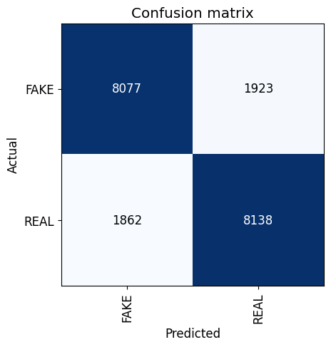

# Results
Using the vision learner in pythons fastai library on the generated ELA and FFT data, see previous post, an accuracy of 90% was obtained. Merging this with the 95% accuracy using the machine learning *Bagging* method it is predicted that a much higher accuracy code be achieved. See confusion matrices below for more information.

## Original CIFake Images Confusion Matrix

## ELA Confusion Matrix

## FFT Confusion Matrix
